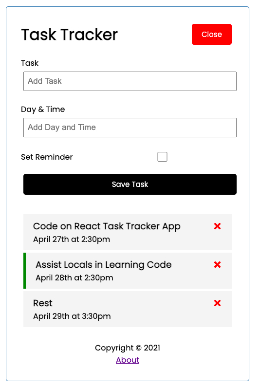

Task Tracker

An application used to track your tasks built with React and CSS.

Project Status
This project is currently in development. Users can add tasks, delete tasks, toggle reminder and check information about the app. Functionality to edit/update tasks, add alarm to reminder will be added.

Project Screen Shot(s)

Installation and Setup Instructions
Clone down this repository. You will need node and npm installed globally on your machine.

Installation:

npm install

To Start json-server:
Use npx to run json-server locally by running "npx json-server --watch db.json --port 5000"

To Start Server:

npm start

To Visit App:

localhost:3000/

Reflection

In this project, I wanted to build an application that allows users to create and track tasks using React technology. In this version, I used json-server as a mock database to allow the state data used in our tracker to be retained as well as enjoying the benefits of database crud functionalities in the absence of api data from a backend server.

At the end of the day, the technologies implemented in this project are React, React-Router, JSX, and CSS. I chose to use the create-react-app boilerplate to minimize initial setup. I also used functional based components and React hooks instead of class based components. In the next iteration I plan on integrating other functionalities like update/edit task, adding alarm to reminder etc.